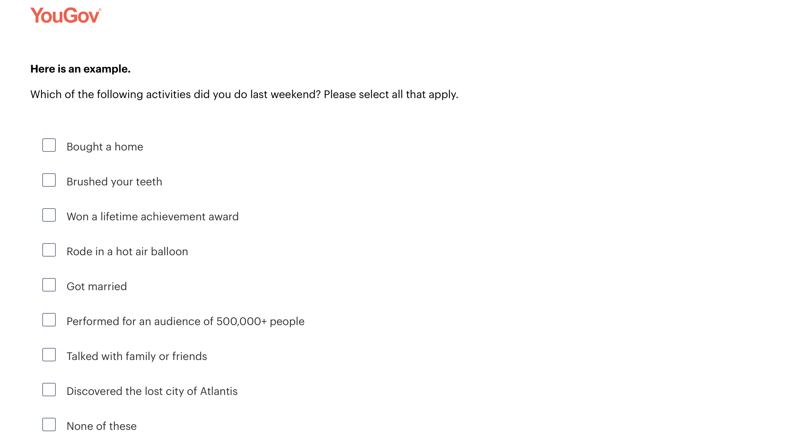
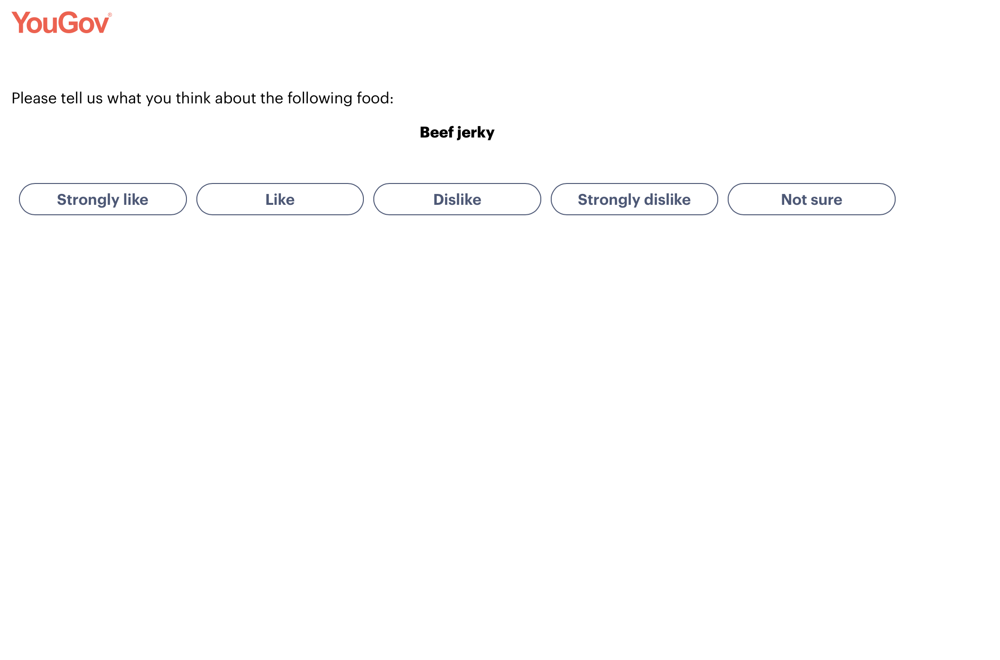

# YouGov Survey Reflection Report

## Introduction

For this activity, I completed a YouGov survey and paid attention to questions that seemed unusual, confusing, or unrelated to what I expected from a survey. Some questions stood out because the answer choices were intentionally strange, while others made me wonder why the researchers wanted that information. Looking at these questions helped me think more carefully about how surveys are designed and how respondents may react to different types of questions.

## Question 1: Activities Completed Last Weekend

{fig-alt="A YouGov survey question asking respondents which activities they did last weekend. The options include ordinary activities such as brushing your teeth and talking with family or friends, as well as unusual activities such as discovering Atlantis and performing for an audience of more than 500,000 people."}

The first question I chose to report asked:

> "Which of the following activities did you do last weekend? Please select all that apply."

I thought this question was weird because the list combined very normal activities with extremely unlikely or impossible activities. For example, "Brushed your teeth" and "Talked with family or friends" are common things that many people probably did. However, other choices included "Won a lifetime achievement award," "Performed for an audience of 500,000+ people," and "Discovered the lost city of Atlantis."

At first, I did not understand why a survey would include such unrealistic choices. After thinking about it, I believe the question may have been designed as an attention check. A respondent who is carefully reading the question would probably select only activities that actually happened. Someone who is clicking through the survey without paying attention might select an obviously impossible answer.

This question showed me that surveys do not always ask questions only because the researchers want information about the topic itself. Sometimes a question may be included to evaluate the quality of the responses and determine whether participants are reading the survey carefully.

## Question 2: Opinion About Beef Jerky

{fig-alt="A YouGov survey screen asking respondents what they think about beef jerky, with response choices of strongly like, like, dislike, strongly dislike, and not sure."}

The second question asked respondents to give their opinion about **beef jerky**, with the choices "Strongly like," "Like," "Dislike," "Strongly dislike," and "Not sure."

I selected this question because it seemed very specific and somewhat random compared with the types of demographic, social, or political questions I normally associate with YouGov. I was curious about why researchers would need to know whether someone likes beef jerky.

Unlike the first example, the question itself was easy to understand. What confused me was its purpose. One possibility is that YouGov was collecting consumer-preference data that could later be used for market research. Companies may want to understand which groups of people like certain foods or products. It is also possible that responses to a question like this could be compared with demographic characteristics or other preferences.

This made me realize that a question can be simple for the participant but still have a research purpose that is not immediately obvious. Survey participants often see only individual questions, while the researcher may be looking for patterns across many different variables.

## Lessons I Learned for My Research Project

Completing the YouGov survey gave me several ideas that I can apply when designing my own research project.

First, I learned that **every survey question should have a clear purpose**. Even when the purpose is not obvious to the respondent, the researcher should know exactly why the question is included and how the response will be used in the analysis. Unnecessary questions can make a survey longer and may cause respondents to lose interest.

Second, I learned the importance of **attention checks and response quality**. The first YouGov example demonstrated one possible way to identify respondents who may not be reading carefully. In my own research, I should think about how I can make sure the data I collect are reliable. At the same time, attention checks should be written carefully so they do not unnecessarily confuse participants.

Third, I learned that **response options need to be clear and complete**. The beef jerky question provided several levels of opinion as well as a "Not sure" option. Providing an appropriate neutral or uncertainty option can be useful because respondents should not be forced to give an opinion when they do not have one.

Fourth, I learned that **survey questions should make sense from the participant's perspective**. Researchers may understand why a question is important, but respondents do not always have that context. If questions seem completely random or unrelated, participants may become confused about the survey's purpose. For my research project, I should organize questions logically and make transitions between different topics when necessary.

Finally, this experience taught me that **good survey design involves more than simply writing questions**. Researchers also need to think about participant attention, wording, answer choices, question order, data quality, and how each response will eventually contribute to answering the research question.

Overall, completing the YouGov survey helped me see survey design from the respondent's point of view. When I create my own research project, I want my questions to be easy to understand, purposeful, and organized in a way that encourages participants to give thoughtful and accurate responses.

# Appendix

- [GitHub Repository](https://github.com/brianvuong1/ibm-6500)
- [Published Article Notes on GitHub Pages](https://brianvuong1.github.io/ibm-6500/IC5-2-Consumer-Panel.html)