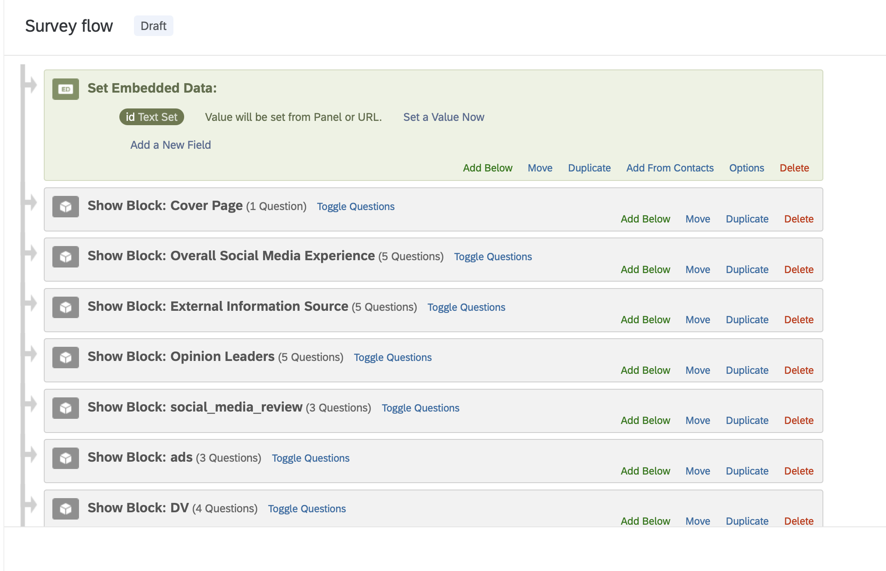
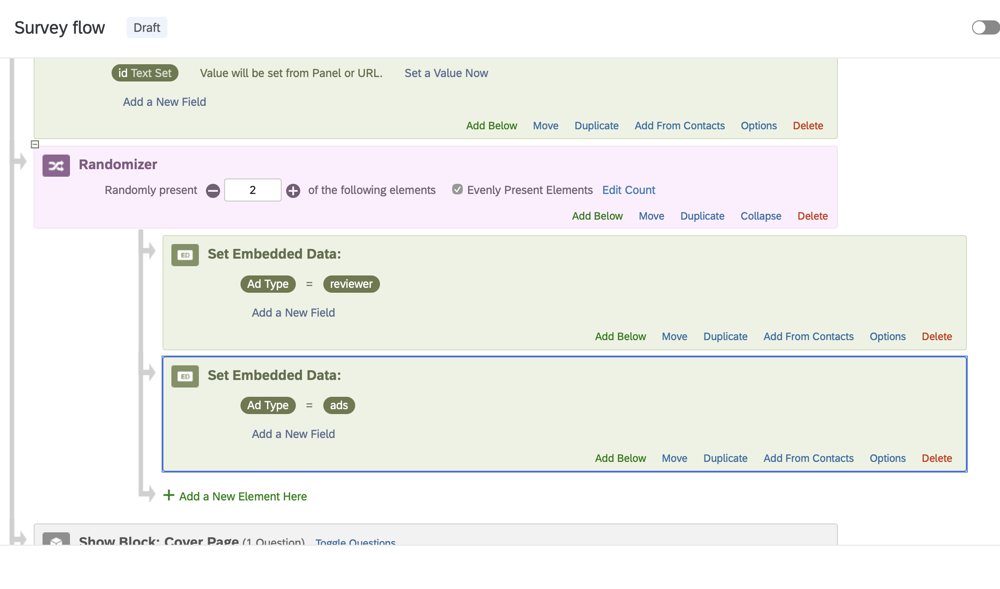
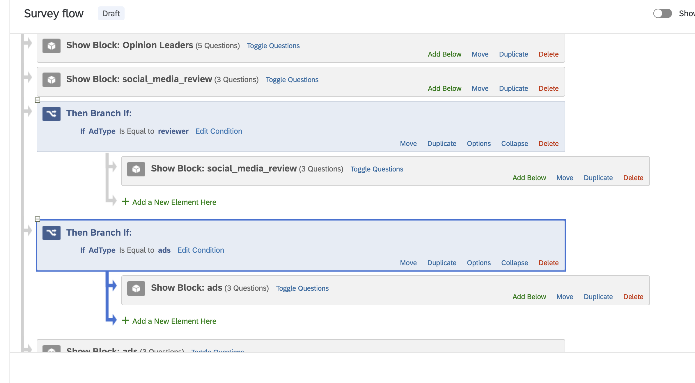
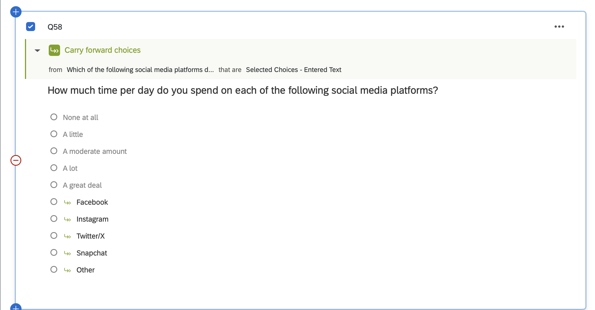
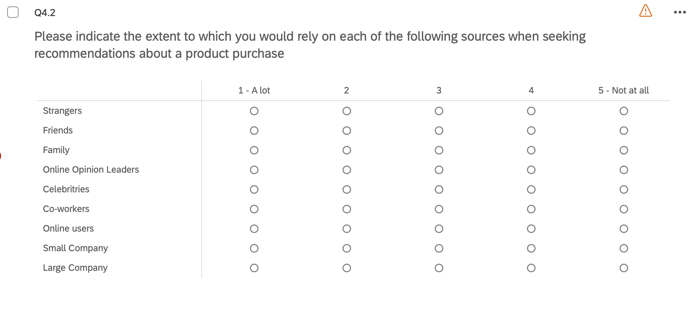
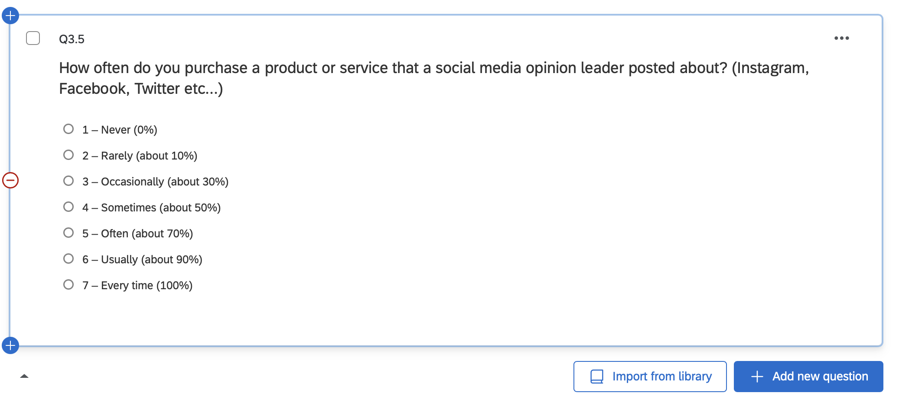
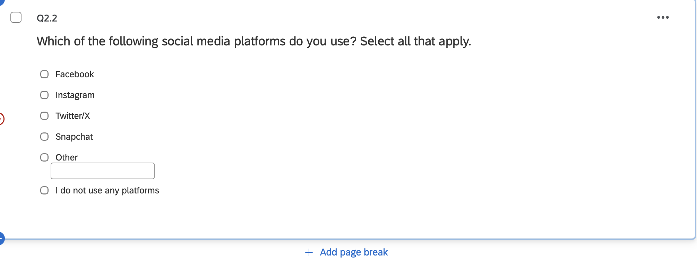

## Qualtrics Experimental Design Assignment

For this assignment, I modified the Social Media Opinion Leader survey in Qualtrics. The major changes included creating a randomized experimental design, routing participants to different advertisement conditions, improving the measurement of social media usage, and making three additional improvements to the questionnaire.

## 1. Survey Flow and Experimental Design

I modified the Survey Flow so that participants are randomly assigned to one of two experimental conditions. The two conditions are the `social_media_review` condition and the `ads` condition.

The randomization occurs near the beginning of the survey after the participant ID is assigned.

{fig-alt="Overall Qualtrics Survey Flow showing the experimental design" width=90%}

## 2. Random Assignment

I added a **Randomizer** to randomly assign participants to one of the two advertisement conditions.

The embedded data variable used for the experimental condition is `Ad Type`.

The two possible values are:

- `reviewer`
- `ads`

{fig-alt="Qualtrics Randomizer assigning participants to one of two Ad Type conditions" width=90%}

This setup allows participants to be randomly assigned to one of the two experimental conditions.

## 3. Branch Logic for Advertisement Conditions

After participants are randomly assigned to an `Ad Type`, I used Branch Logic to determine which advertisement block they receive.

Participants assigned to the `reviewer` condition are shown the `social_media_review` block.

Participants assigned to the `ads` condition are shown the `ads` block.

{fig-alt="Qualtrics branch logic routing participants to the appropriate advertisement condition" width=90%}

The `DV` block remains outside the two branches so that all participants answer the same dependent-variable questions after viewing their assigned advertisement.

## 4. Improving the Social Media Usage Question

The original social media usage question measured overall social media use. This made it difficult to determine how much time a participant spends on each individual platform.

I revised the question so that respondents can select all of the social media platforms they use rather than selecting only one.

The revised question asks:

> Which of the following social media platforms do you use? Select all that apply.

I also changed the question setting so that multiple responses can be selected.

A second question was then used to measure the amount of time respondents spend on each platform they selected.

I used the **Carry Forward Choices** function and selected **Selected Choices** from the previous social media platform question.

{fig-alt="Carry Forward Choices setup for selected social media platforms" width=90%}

This allows the next question to display only the social media platforms that the respondent previously selected.

For example, if a respondent selects Instagram and Snapchat, the next question asks about their usage of Instagram and Snapchat rather than displaying every possible platform.

## 5. Additional Questionnaire Improvements

In addition to the experimental design and Carry Forward function, I reviewed the questionnaire and made three additional improvements.

### Improvement 1: Rewording a Question

I revised the wording of one question to make it clearer and easier for respondents to understand.

The original wording was:

> Please indicate the extent to which you would rely on the following to get recommendations from to purchase a product?

I revised the question to:

> Please indicate the extent to which you would rely on each of the following sources when seeking recommendations about a product purchase.

The revised wording is clearer and more grammatically consistent.

{fig-alt="Qualtrics question with improved wording" width=90%}

### Improvement 2: Rewording Response Choices

I revised the response choices for a question asking how often respondents purchase a product or service that a social media opinion leader posted about.

The original response choices were lengthy and somewhat difficult to compare.

I simplified and standardized the wording so that the choices were easier to read:

1. Never (0%)
2. Rarely (about 10%)
3. Occasionally (about 30%)
4. Sometimes (about 50%)
5. Often (about 70%)
6. Usually (about 90%)
7. Every time (100%)

{fig-alt="Qualtrics question with revised and standardized response choices" width=90%}

This change makes the response scale more consistent and easier for respondents to understand.

### Improvement 3: Adding an Additional Response Option

For my third improvement, I added an additional response option to a question where the original set of choices may not have represented every possible response.

Adding another response option gives respondents a more complete set of choices and reduces the chance that they will have to select an answer that does not accurately represent them.

{fig-alt="Qualtrics question showing an additional response option" width=90%}

## 6. Testing the Survey

After making the changes, I used Qualtrics Preview mode to test the survey multiple times.

I verified that:

- Participants are assigned to only one advertisement condition.
- Participants do not see both advertisement treatments.
- The `DV` questions appear regardless of which advertisement condition is assigned.
- The social media question allows respondents to select multiple platforms.
- The Carry Forward question displays only the platforms selected in the previous question.

## Conclusion

The revised Qualtrics survey uses a between-subjects experimental design in which participants are randomly assigned to one of two advertisement conditions.

Branch Logic ensures that participants see only their assigned advertisement condition, while all participants subsequently answer the same dependent-variable questions.

The revised social media questions also provide more detailed information by allowing respondents to identify all platforms they use and report their usage for each platform separately.

Finally, three additional questionnaire improvements were made by improving question wording, simplifying response choices, and adding an additional response option.