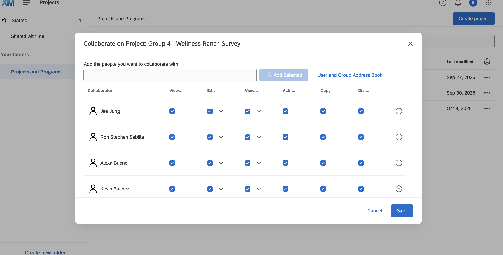

# Appendix

- [GitHub Repository](https://github.com/brianvuong1/ibm-6500)
- [Published Article Notes on GitHub Pages](https://brianvuong1.github.io/ibm-6500/group-4-wellness-ranch-survey.html)
- [Qualtrics Survey](https://cpp.pdx1.qualtrics.com/survey-builder/SV_emqFZ0Yr9Z2fgrk/edit)
- [Construct table](https://docs.google.com/document/d/1Y27DsO9x2OFT71ipNMHRLTjvJTlpeoeT/edit?usp=share_link&ouid=102053154635546890348&rtpof=true&sd=true)